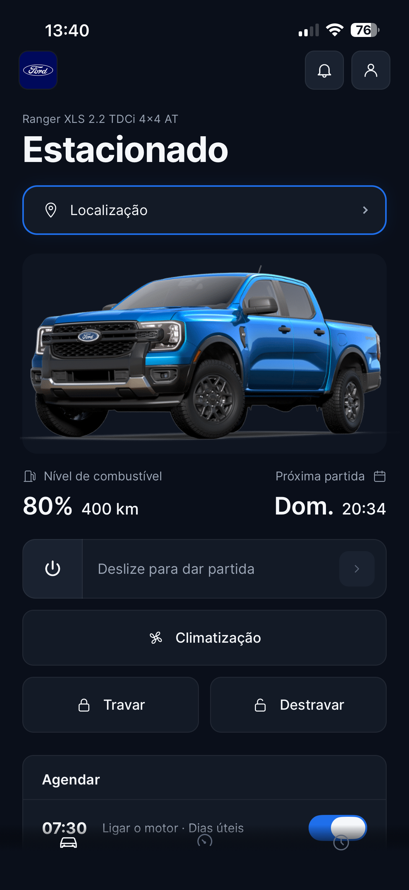

# Ford Connect

[](https://github.com/Carti011/Ford-Connect/actions/workflows/ci.yml)

App mobile e API REST para proprietários de veículos Ford. Permite ao usuário visualizar dados do seu veículo, histórico de manutenções e alertas de revisão pendentes.

Desenvolvido como parte do **Ford FIAP Challenge 2026** — atacando o desafio de retenção de clientes na rede oficial Ford através de visibilidade proativa sobre o veículo e sua manutenção.


<p align="center">
  
  
  
</p>

---

## Sumário

- [Sobre o projeto](#sobre-o-projeto)
- [Stack](#stack)
- [Estrutura de pastas](#estrutura-de-pastas)
- [Pré-requisitos](#pré-requisitos)
- [Quickstart](#quickstart)
- [Como o app encontra o backend](#como-o-app-encontra-o-backend)
- [Desenvolvimento local](#desenvolvimento-local)
- [Cenários avançados](#cenários-avançados)
- [Variáveis de ambiente](#variáveis-de-ambiente)
- [API](#api)
- [Testes](#testes)
- [Comandos úteis](#comandos-úteis)
- [Documentação](#documentação)
- [Números do projeto](#números-do-projeto)
- [Highlights técnicos](#highlights-técnicos)

---

## Sobre o projeto

A Ford trouxe dois desafios para times de estudantes da FIAP em 2026. Este projeto resolve o **Desafio 2 — VIN Share / Retenção de Clientes**: identificar e engajar proprietários com risco de não retornar para manutenção paga na rede oficial Ford.

A abordagem do app:

- Dar visibilidade ao dono do carro sobre seu veículo, histórico de serviços e alertas de revisão
- Reduzir atrito de informação que hoje leva clientes a buscar oficinas independentes
- Servir como camada de relacionamento entre o cliente final e a rede de concessionárias

A Sprint 1 entrega um MVP com dados mockados via seed — sem integração real com sistemas Ford.

---

## Stack

### Backend

- **Java 21** + **Spring Boot 3.3.5**
- **Spring Security** com autenticação **JWT** (jjwt)
- **Spring Data JPA** + **Hibernate**
- **PostgreSQL 16** rodando em container Docker (banco efêmero, recriado a cada `docker-compose up`)
- **Flyway** para migrations versionadas
- **springdoc-openapi** para documentação Swagger
- **JUnit 5** + **Mockito** para testes
- **Maven** para build

### Mobile

- **React Native** com **Expo SDK 54**
- **Expo Router** (file-based routing)
- **TypeScript** em modo strict
- **expo-secure-store** para armazenamento do JWT
- **axios** com interceptor para autenticação automática
- **Jest** + **@testing-library/react-native** para testes

### Infraestrutura

- **Docker** + **Docker Compose** para ambiente local — sobe banco + backend com um comando
- **GitHub Actions** para CI (testes backend + Jest + TypeScript no mobile)

---

## Estrutura de pastas

```
.
├── backend/                       Java Spring Boot
│   ├── src/main/java/br/com/fordapp/
│   │   ├── controller/            endpoints REST
│   │   ├── service/               regras de negócio
│   │   ├── repository/            acesso ao banco
│   │   ├── model/                 entidades JPA
│   │   ├── dto/                   contratos de entrada e saída
│   │   ├── security/              configuração de JWT e Spring Security
│   │   └── exception/             tratamento global de erros
│   ├── src/main/resources/
│   │   ├── application.yml        config principal
│   │   ├── application-test.yml   config para testes (H2)
│   │   └── db/migration/          scripts Flyway versionados
│   ├── pom.xml
│   └── Dockerfile
│
├── mobile/                        React Native + Expo
│   ├── app/                       rotas (Expo Router)
│   │   ├── (tabs)/                navegação principal
│   │   ├── _layout.tsx            layout raiz com proteção de rotas
│   │   └── login.tsx              tela de login
│   ├── components/                componentes reutilizáveis
│   ├── contexts/                  estado global (autenticação)
│   ├── hooks/                     hooks customizados
│   ├── services/                  chamadas à API
│   ├── constants/                 design tokens
│   ├── types/                     tipos TypeScript compartilhados
│   └── __tests__/                 testes Jest
│
├── docs/
│   └── adr/                       Architecture Decision Records
│
├── .github/workflows/ci.yml       pipeline de CI
├── docker-compose.yml             orquestração local
└── .env.example                   modelo de variáveis (apenas JWT_SECRET)
```

---

## Pré-requisitos

- **Git**
- **Docker Desktop** — usado tanto no caminho rápido quanto para subir o banco em desenvolvimento
- **Node.js 20+** com **npm** (para o mobile)
- **Expo Go** instalado no celular (Android ou iOS) **ou** simulador iOS / emulador Android configurado

Apenas se for rodar o backend **fora** do Docker:

- **Java 21** (Temurin recomendado — `sdk install java 21-tem` se usar SDKMAN)
- O Maven já vem incluído via wrapper `./mvnw`, não precisa instalar

---

## Quickstart

Roda o projeto inteiro (backend + mobile). Vale para qualquer rede Wi-Fi, em qualquer máquina — não há IP para configurar manualmente.

### Você recebeu um ZIP

Descompacte e entre na pasta:

```bash
unzip ford-connect-completo-*.zip
cd ford-connect-completo-*
```

O `.env` já vem pronto dentro do zip. Pule para o passo 2.

### Você clonou do GitHub

```bash
git clone https://github.com/Carti011/Ford-Connect.git
cd Ford-Connect

# crie o .env a partir do exemplo
cp .env.example .env

# preencha o JWT_SECRET (qualquer string com 64+ caracteres)
# em macOS / Linux:
echo "JWT_SECRET=$(openssl rand -hex 64)" >> .env
echo "JWT_EXPIRATION_MS=86400000" >> .env
```

### 2. Subir banco + backend

```bash
docker-compose up -d
```

Sobe PostgreSQL e o backend Java de uma vez. Na primeira execução o build da imagem do backend leva alguns minutos. Quando terminar, o Swagger fica em [http://localhost:8080/swagger-ui.html](http://localhost:8080/swagger-ui.html).

### 3. Rodar o mobile

Em outro terminal, ainda na raiz do projeto:

```bash
cd mobile
npm install
npx expo start --clear
```

Escaneie o QR code com o **Expo Go** no celular (mesma rede Wi-Fi do computador) ou aperte `i` para simulador iOS / `a` para emulador Android.

> O app **descobre automaticamente** o endereço do backend a partir do servidor de dev do Expo. Sem precisar de IP, sem precisar de `.env.local`. Basta o celular e o computador estarem na mesma rede.

### Credenciais de teste

O Flyway popula o banco com dados mockados na primeira execução. Para autenticar via app ou Swagger:

- **email:** `joao@fordconnect.com`
- **senha:** `ford@123`

Outros usuários estão em [backend/src/main/resources/db/migration/V2__seed_dados_mockados.sql](backend/src/main/resources/db/migration/V2__seed_dados_mockados.sql).

---

## Como o app encontra o backend

Pra evitar o problema clássico de "funciona na minha máquina mas não na sua", a `baseURL` da API é resolvida em três níveis, nesta ordem:

1. **`EXPO_PUBLIC_API_URL` definido em `mobile/.env.local`** — tem prioridade absoluta. Use quando quiser apontar para um backend remoto, um deploy de produção, um túnel ngrok, etc.
2. **Servidor de dev do Expo** — quando você roda `npx expo start`, o Expo já sabe o IP da máquina na rede. O app extrai esse IP e monta `http://<ip>:8080`. Funciona em qualquer rede, sem configuração.
3. **Fallback local** — `http://localhost:8080` no simulador iOS / web e `http://10.0.2.2:8080` no emulador Android.

Lógica implementada em [mobile/services/api.ts](mobile/services/api.ts). Existe um `mobile/.env.local.example` no repositório para referência.

---

## Desenvolvimento local

Cenário para quem vai modificar código. Backend pelo Maven com hot reload, banco em Docker.

### Backend

```bash
# subir só o banco
docker-compose up -d postgres

# em outro terminal: rodar o backend
cd backend
./mvnw spring-boot:run
```

Como atalho, existe um script `backend/dev.sh` que exporta as variáveis de ambiente e sobe o backend de uma vez. O arquivo é gitignored — cada dev mantém o seu localmente. Para criar o seu na primeira vez:

```bash
cp backend/dev.sh.example backend/dev.sh
chmod +x backend/dev.sh
bash backend/dev.sh
```

### Mobile

```bash
cd mobile
npm install
npx expo start --clear
```

Pronto. Não precisa criar `.env.local`, não precisa configurar IP. O QR code aparece no terminal; escaneie no celular com o Expo Go ou pressione `i` / `a` para simulador / emulador.

Se em algum cenário você precisar **forçar** uma URL específica (apontar para um backend remoto, etc.), copie o exemplo e edite:

```bash
cp mobile/.env.local.example mobile/.env.local
# edite mobile/.env.local definindo EXPO_PUBLIC_API_URL
```

---

## Cenários avançados

O fluxo padrão do projeto é rodar tudo localmente em Docker — banco, backend e mobile, todos em uma única máquina. Essa é a configuração suportada e a que a documentação principal cobre. Para casos específicos onde alguém quer ir além disso, esta seção descreve o que é possível.

### Apontar o backend para um banco externo (Neon, RDS, postgres em outra máquina)

Útil para times que queiram compartilhar uma base de dados ou para integrar com um banco já existente.

Em vez de usar `docker-compose up -d`, rode o backend direto via Maven com variáveis apontando para o seu banco:

```bash
cd backend

export PGHOST=seu-host.exemplo.com
export PGDATABASE=seu_banco
export PGUSER=seu_usuario
export PGPASSWORD=sua_senha
export PGSSLMODE=require   # use 'disable' se o banco não tiver SSL
export JWT_SECRET=$(openssl rand -hex 64)
export JWT_EXPIRATION_MS=86400000

./mvnw spring-boot:run
```

A migração de schema é feita pelo Flyway automaticamente na primeira inicialização — o banco precisa existir mas pode estar vazio. As tabelas e os dados de seed serão criados a partir dos scripts em [backend/src/main/resources/db/migration/](backend/src/main/resources/db/migration/).

Para tornar isso recorrente, copie o `backend/dev.sh.example` para `backend/dev.sh` (gitignored) e ajuste os valores:

```bash
cp backend/dev.sh.example backend/dev.sh
chmod +x backend/dev.sh
# edite backend/dev.sh com os valores do seu banco
bash backend/dev.sh
```

### Apontar o app para um backend remoto

Por padrão, o app descobre o backend automaticamente na rede local. Para apontar para um backend específico (deploy em produção, túnel ngrok, backend em outra máquina), defina a URL no `mobile/.env.local`:

```bash
cp mobile/.env.local.example mobile/.env.local
```

Edite `mobile/.env.local`:

```env
EXPO_PUBLIC_API_URL=https://seu-backend.exemplo.com
```

Reinicie o Expo (`Ctrl+C` e `npx expo start --clear`) para o app pegar a nova URL.

### Fazer deploy do backend em uma plataforma (Railway, Render, Fly.io, etc.)

O [backend/Dockerfile](backend/Dockerfile) é multi-stage e está pronto para deploy em qualquer plataforma que aceite Docker.

Roteiro geral:

1. Conecte o repositório no painel da plataforma escolhida
2. Aponte o build context para `/backend`
3. Configure as variáveis de ambiente exigidas (mesmas do dev.sh):
   - `PGHOST`, `PGDATABASE`, `PGUSER`, `PGPASSWORD`, `PGSSLMODE`
   - `JWT_SECRET` (gere com `openssl rand -hex 64`), `JWT_EXPIRATION_MS`
4. O banco precisa estar acessível pela URL pública da plataforma — use Neon, Supabase, RDS ou outro PostgreSQL gerenciado
5. Depois do deploy, aponte o app para a URL gerada usando `EXPO_PUBLIC_API_URL` (ver seção anterior)

A configuração CORS em [backend/src/main/java/br/com/fordapp/security/SecurityConfig.java](backend/src/main/java/br/com/fordapp/security/SecurityConfig.java) precisa receber a origem do front se o app for acessado via navegador (`expo start --web`). Para uso nativo no celular (Expo Go ou build nativo), CORS é irrelevante.

---

## Variáveis de ambiente

### Backend via Docker Compose (caso padrão)

As credenciais do banco são fixas dentro do [docker-compose.yml](docker-compose.yml) — banco local efêmero, sem segredos. O único valor que precisa vir do `.env` é o `JWT_SECRET`.

| Variável            | Obrigatória | Descrição                                                                |
| ------------------- | ----------- | ------------------------------------------------------------------------ |
| `JWT_SECRET`        | sim         | Segredo HS256 do JWT — mínimo 64 caracteres. Gere com `openssl rand -hex 64` |
| `JWT_EXPIRATION_MS` | não         | Expiração do token em ms. Default: `86400000` (24h)                      |

### Backend rodando direto via Maven (`dev.sh`)

Se você roda o backend fora do Docker (apontando para um banco arbitrário — postgres local em outra máquina, Neon, RDS), passa as variáveis exportadas no `dev.sh` antes de chamar `./mvnw`:

| Variável            | Obrigatória | Descrição                                                  |
| ------------------- | ----------- | ---------------------------------------------------------- |
| `PGHOST`            | sim         | Host do PostgreSQL                                         |
| `PGDATABASE`        | sim         | Nome do banco                                              |
| `PGUSER`            | sim         | Usuário do banco                                           |
| `PGPASSWORD`        | sim         | Senha do banco                                             |
| `PGSSLMODE`         | não         | `disable` em local, `require` para Neon. Default: `disable` |
| `JWT_SECRET`        | sim         | Mesmo significado da tabela acima                          |
| `JWT_EXPIRATION_MS` | não         | Idem                                                       |

### Mobile

| Variável              | Obrigatória | Descrição                                                                                   |
| --------------------- | ----------- | ------------------------------------------------------------------------------------------- |
| `EXPO_PUBLIC_API_URL` | **não**     | URL base da API. Quando ausente, o app descobre o endereço do backend automaticamente. Defina apenas para forçar uma URL específica (deploy remoto, túnel ngrok, etc.) |

O prefixo `EXPO_PUBLIC_` é necessário para que a variável seja exposta ao bundle do app.

---

## API

Base URL local: `http://localhost:8080`

### Endpoints principais

| Método | Rota                             | Autenticação | Descrição                            |
| ------ | -------------------------------- | ------------ | ------------------------------------ |
| POST   | `/api/autenticacao/login`        | Pública      | Autenticação com email e senha → JWT |
| GET    | `/api/veiculos/{id}`             | Bearer JWT   | Dados do veículo                     |
| GET    | `/api/veiculos/{id}/manutencoes` | Bearer JWT   | Histórico de manutenções             |
| GET    | `/api/veiculos/{id}/alertas`     | Bearer JWT   | Alertas de revisão pendentes         |

### Documentação interativa

Com o backend rodando, a documentação Swagger fica em:

- **Swagger UI:** http://localhost:8080/swagger-ui.html
- **OpenAPI JSON:** http://localhost:8080/api-docs

---

## Testes

### Backend

```bash
cd backend
./mvnw test -Dspring.profiles.active=test
```

O perfil `test` usa H2 em memória — não requer PostgreSQL nem nenhuma variável de ambiente configurada.

### Mobile

```bash
cd mobile
npm test
```

Outras variantes:

```bash
npm test -- --watch          # modo watch para desenvolvimento
npm test -- --coverage       # gera relatório de cobertura
npm test -- --ci             # modo CI (sem watch, mais estrito)
```

---

## Comandos úteis

```bash
# Verificar tipos TypeScript no mobile sem compilar
cd mobile && npx tsc --noEmit

# Subir mobile em modo túnel (útil quando celular e PC não estão na mesma rede)
cd mobile && npx expo start --tunnel

# Ver logs do backend no Docker
docker-compose logs -f backend

# Ver logs do banco no Docker
docker-compose logs -f postgres

# Resetar tudo (apaga volume do banco — começa do zero, Flyway re-popula)
docker-compose down -v && docker-compose up -d

# Conectar no banco via psql dentro do container
docker exec -it ford_app_db psql -U ford -d ford_mobile

# Gerar um JWT_SECRET aleatório (256 bits em hex)
openssl rand -hex 64
```

---

## Documentação

- **`docs/adr/`** — todas as decisões arquiteturais relevantes registradas como ADRs numeradas
- **`docs/handoff/`** — handoffs entre sessões de trabalho (excluídos do git por padrão; servem como contexto de quem está retomando o projeto)
- **`backend/src/main/resources/db/migration/`** — schema versionado e seed de dados

---

## Números do projeto

| Métrica                 | Valor |
| ----------------------- | ----- |
| Endpoints REST          | 4     |
| Telas mobile            | 5     |
| Testes Jest (mobile)    | 36    |
| Testes JUnit (backend)  | 23    |
| Migrations Flyway       | 8     |
| ADRs documentados       | 21    |

---

## Highlights técnicos

- **Cybersecurity embutida** — JWT com expiração configurável, validação de inputs com Bean Validation, CORS restrito, rate limiting por IP, respostas de erro sem stack trace ou detalhes internos
- **Arquitetura em camadas** — separação rígida de `controller → service → repository`, DTOs no contrato externo, entidades nunca expostas, lógica de negócio fora do controller
- **TDD no backend** — testes escritos antes da implementação, cobrindo controllers, services e o handler global de erros
- **CI completo bloqueando merge** — pipeline GitHub Actions roda testes do backend (JUnit + H2 em memória), Jest no mobile e verificação de tipos TypeScript. Branch protection na `main` exige todos os checks verdes
- **Histórico de decisões versionado** — toda decisão arquitetural relevante registrada como ADR em `docs/adr/`, permitindo entender o porquê de cada escolha mesmo meses depois
